# RAG Solution Architecture Document
## Comprehensive Guide to Retrieval-Augmented Generation Systems

---

## **Table of Contents**

1. [Executive Summary](#executive-summary)
2. [System Overview](#system-overview)
3. [High-Level Architecture](#high-level-architecture)
4. [Component Architecture](#component-architecture)
5. [Data Flow Architecture](#data-flow-architecture)
6. [How RAG Works](#how-rag-works)
7. [Technology Stack](#technology-stack)
8. [Implementation Considerations](#implementation-considerations)
9. [Security Architecture](#security-architecture)
10. [Scalability & Performance](#scalability--performance)
11. [Deployment Architecture](#deployment-architecture)
12. [Monitoring & Observability](#monitoring--observability)

---

## **Executive Summary**

### **What is RAG?**
Retrieval-Augmented Generation (RAG) is an AI architecture pattern that enhances Large Language Models (LLMs) by providing them with relevant, up-to-date information from external knowledge sources during the generation process. This approach combines the reasoning capabilities of LLMs with the accuracy and freshness of retrieved information.

### **Business Value**
- **Accuracy**: Reduces hallucinations by grounding responses in factual data
- **Currency**: Provides access to real-time and updated information
- **Cost-Effectiveness**: Avoids expensive model retraining for new information
- **Transparency**: Enables source attribution and fact verification
- **Customization**: Allows domain-specific knowledge integration

### **Key Components**
- **Knowledge Base**: Document repositories and data sources
- **Vector Database**: Semantic search and similarity matching
- **Embedding Models**: Text-to-vector conversion
- **Large Language Model**: Natural language understanding and generation
- **Orchestration Layer**: Query processing and response assembly

---

## **System Overview**

### **RAG System Architecture Overview**
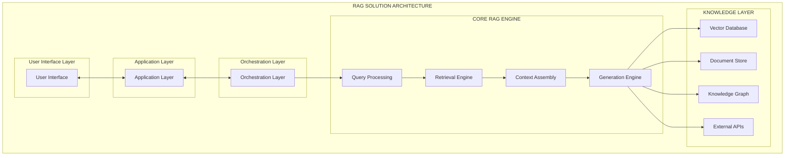

### **Core Principles**
1. **Separation of Concerns**: Clear boundaries between retrieval, processing, and generation
2. **Modularity**: Interchangeable components for different use cases
3. **Scalability**: Horizontal scaling capabilities for high-volume applications
4. **Extensibility**: Plugin architecture for custom components
5. **Observability**: Comprehensive monitoring and logging throughout the pipeline

---

## **High-Level Architecture**

### **System Architecture Diagram**
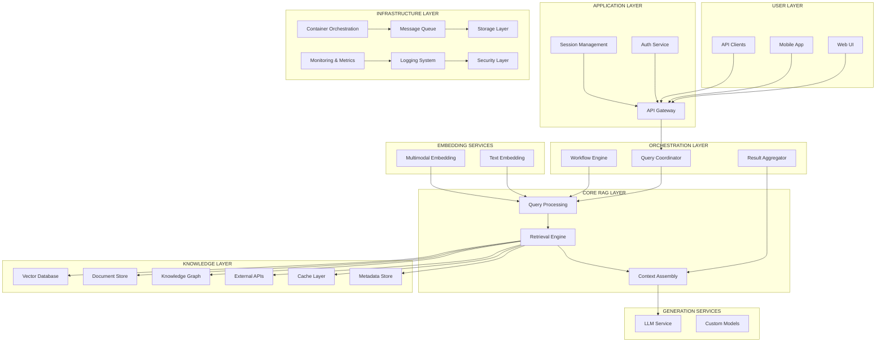

---

## **Component Architecture**

### **Core RAG Components**

#### **1. Query Processing Component**
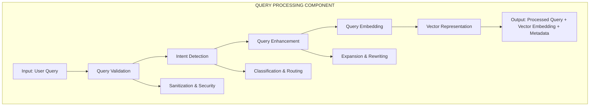

#### **2. Retrieval Engine Component**
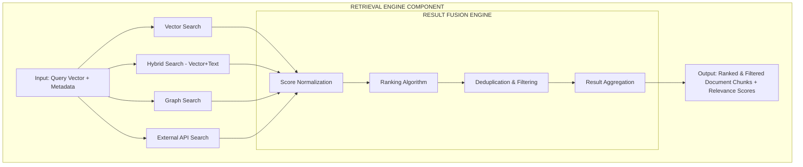

#### **3. Context Assembly Component**
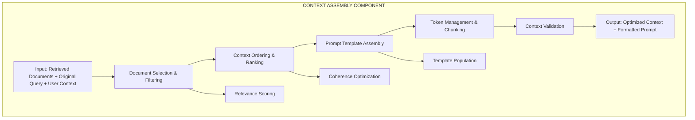

#### **4. Generation Engine Component**
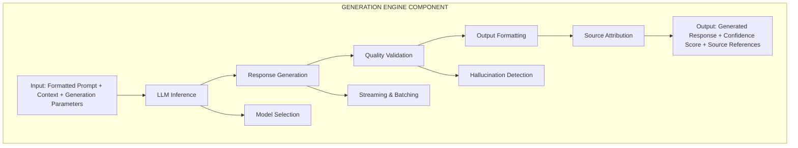

---

## **Data Flow Architecture**

### **End-to-End Data Flow Diagram**
```mermaid
graph TD
    UserQuery[User Query]
    
    subgraph "INGESTION PHASE"
        QueryReception[Query Reception]
        InputValidation[Input Validation]
        QueryParsing[Query Parsing]
        SecurityCheck[Security Check]
        
        QueryReception --> InputValidation
        InputValidation --> QueryParsing
        QueryParsing --> SecurityCheck
    end
    
    subgraph "PROCESSING PHASE"
        IntentAnalysis[Intent Analysis]
        QueryEnhancement[Query Enhancement]
        QueryEmbedding[Query Embedding]
        VectorGeneration[Vector Generation]
        
        IntentAnalysis --> QueryEnhancement
        QueryEnhancement --> QueryEmbedding
        QueryEmbedding --> VectorGeneration
    end
    
    subgraph "RETRIEVAL PHASE"
        VectorSearch[Vector Search]
        SimilarityMatching[Similarity Matching]
        DocumentRetrieval[Document Retrieval]
        ResultRanking[Result Ranking]
        VectorDatabase[(Vector Database)]
        TopKDocs[Top-K Documents]
        
        VectorSearch --> SimilarityMatching
        SimilarityMatching --> DocumentRetrieval
        DocumentRetrieval --> ResultRanking
        VectorSearch --> VectorDatabase
        ResultRanking --> TopKDocs
    end
    
    subgraph "AUGMENTATION PHASE"
        ContextSelection[Context Selection]
        PromptAssembly[Prompt Assembly]
        ContextValidation[Context Validation]
        FinalPrompt[Final Prompt]
        
        ContextSelection --> PromptAssembly
        PromptAssembly --> ContextValidation
        ContextValidation --> FinalPrompt
    end
    
    subgraph "GENERATION PHASE"
        LLMInference[LLM Inference]
        ResponseGeneration[Response Generation]
        QualityValidation[Quality Validation]
        ResponseFormatting[Response Formatting]
        
        LLMInference --> ResponseGeneration
        ResponseGeneration --> QualityValidation
        QualityValidation --> ResponseFormatting
    end
    
    subgraph "DELIVERY PHASE"
        SourceAttribution[Source Attribution]
        ResponseEnrichment[Response Enrichment]
        LoggingMetrics[Logging & Metrics]
        ResponseDelivery[Response Delivery]
        
        SourceAttribution --> ResponseEnrichment
        ResponseEnrichment --> LoggingMetrics
        LoggingMetrics --> ResponseDelivery
    end
    
    FinalResponse[Final Response to User]
    
    UserQuery --> QueryReception
    SecurityCheck --> IntentAnalysis
    VectorGeneration --> VectorSearch
    TopKDocs --> ContextSelection
    FinalPrompt --> LLMInference
    ResponseFormatting --> SourceAttribution
    ResponseDelivery --> FinalResponse
```

### **Knowledge Base Data Flow**
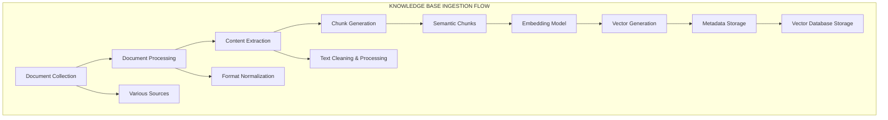

---

## **How RAG Works**

### **Step-by-Step RAG Process**

#### **Phase 1: Knowledge Base Preparation**
```
1. Document Collection
   ├── Gather documents from various sources
   ├── Support multiple formats (PDF, Word, HTML, etc.)
   └── Validate document quality and accessibility

2. Document Processing
   ├── Extract text content from documents
   ├── Clean and normalize text
   ├── Handle special characters and formatting
   └── Preserve document structure and metadata

3. Text Chunking
   ├── Split documents into manageable chunks
   ├── Maintain semantic coherence
   ├── Optimize chunk size for retrieval
   └── Create overlapping chunks for context preservation

4. Vector Embedding
   ├── Convert text chunks to vector representations
   ├── Use pre-trained embedding models
   ├── Ensure consistent embedding dimensions
   └── Store embeddings with metadata

5. Index Creation
   ├── Build vector database index
   ├── Optimize for similarity search
   ├── Create metadata indexes
   └── Implement efficient storage structure
```

#### **Phase 2: Query Processing**
```
1. Query Reception
   ├── Receive user query through interface
   ├── Validate input format and content
   ├── Apply security and content filters
   └── Log query for monitoring

2. Query Analysis
   ├── Analyze query intent and complexity
   ├── Identify key entities and concepts
   ├── Determine query type (factual, analytical, etc.)
   └── Extract query parameters

3. Query Enhancement
   ├── Expand query with synonyms
   ├── Add context from conversation history
   ├── Rewrite for better retrieval
   └── Generate query variations if needed

4. Query Embedding
   ├── Convert query to vector representation
   ├── Use same embedding model as documents
   ├── Normalize vector for similarity search
   └── Prepare for retrieval phase
```

#### **Phase 3: Information Retrieval**
```
1. Similarity Search
   ├── Perform vector similarity search
   ├── Calculate cosine similarity scores
   ├── Apply distance thresholds
   └── Retrieve top-K candidates

2. Hybrid Search (Optional)
   ├── Combine vector search with keyword search
   ├── Apply different weighting strategies
   ├── Merge and rank results
   └── Improve recall and precision

3. Result Filtering
   ├── Apply relevance thresholds
   ├── Remove duplicate content
   ├── Filter by metadata criteria
   └── Ensure content quality

4. Result Ranking
   ├── Score results by relevance
   ├── Consider recency and authority
   ├── Apply business rules
   └── Select final document set
```

#### **Phase 4: Context Assembly**
```
1. Document Selection
   ├── Choose most relevant documents
   ├── Balance relevance and diversity
   ├── Consider token limitations
   └── Maintain source attribution

2. Context Ordering
   ├── Order documents by relevance
   ├── Group related content
   ├── Optimize for LLM processing
   └── Ensure logical flow

3. Prompt Construction
   ├── Create structured prompt template
   ├── Include system instructions
   ├── Add retrieved context
   └── Append user query

4. Token Management
   ├── Monitor token count limits
   ├── Truncate content if necessary
   ├── Preserve most important information
   └── Optimize context window usage
```

#### **Phase 5: Response Generation**
```
1. LLM Inference
   ├── Send prompt to language model
   ├── Configure generation parameters
   ├── Monitor inference performance
   └── Handle model responses

2. Response Processing
   ├── Extract generated text
   ├── Validate response quality
   ├── Check for hallucinations
   └── Ensure factual accuracy

3. Source Attribution
   ├── Map response to source documents
   ├── Provide citation information
   ├── Enable fact verification
   └── Support transparency

4. Response Formatting
   ├── Format for target interface
   ├── Add metadata and sources
   ├── Apply styling and structure
   └── Prepare for delivery
```

#### **Phase 6: Response Delivery**
```
1. Quality Assurance
   ├── Final quality checks
   ├── Content safety validation
   ├── Compliance verification
   └── Performance metrics collection

2. Response Enhancement
   ├── Add helpful suggestions
   ├── Include related topics
   ├── Provide follow-up options
   └── Enhance user experience

3. Logging and Monitoring
   ├── Log complete interaction
   ├── Record performance metrics
   ├── Track user satisfaction
   └── Monitor system health

4. Response Delivery
   ├── Send response to user
   ├── Update conversation state
   ├── Cache for future use
   └── Complete interaction cycle
```

---

## **Technology Stack**

### **Recommended Technology Stack**

#### **Core Components**
```mermaid
graph TB
    subgraph "TECHNOLOGY STACK"
        subgraph "PRESENTATION LAYER"
            Frontend[Frontend: React.js, Vue.js, Angular]
            Mobile[Mobile: React Native, Flutter]
            APIGateway[API Gateway: Kong, AWS API Gateway, Azure API Management]
        end
        
        subgraph "APPLICATION LAYER"
            Backend[Backend: Python (FastAPI), Node.js, Java (Spring Boot)]
            Orchestration[Orchestration: Apache Airflow, Prefect, Temporal]
            Authentication[Authentication: Auth0, Keycloak, AWS Cognito]
        end
        
        subgraph "RAG LAYER"
            Framework[Framework: LangChain, LlamaIndex, Haystack]
            Embedding[Embedding: OpenAI, Sentence Transformers, Cohere]
            LLM[LLM: OpenAI GPT, Anthropic Claude, Azure OpenAI]
        end
        
        subgraph "DATA LAYER"
            VectorDB[Vector DB: Pinecone, Weaviate, Chroma, Qdrant]
            DocumentDB[Document DB: MongoDB, PostgreSQL, Elasticsearch]
            GraphDB[Graph DB: Neo4j, Amazon Neptune, ArangoDB]
            Cache[Cache: Redis, Memcached]
        end
        
        subgraph "INFRASTRUCTURE LAYER"
            Container[Container: Docker, Kubernetes]
            Cloud[Cloud: AWS, Azure, Google Cloud]
            Monitoring[Monitoring: Prometheus, Grafana, DataDog]
            Logging[Logging: ELK Stack, Fluentd, Splunk]
        end
    end
```

#### **Component Selection Matrix**
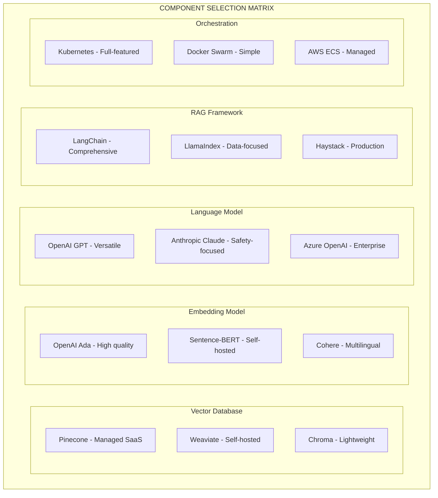

---

## **Implementation Considerations**

### **Architecture Decisions**

#### **1. Deployment Architecture Options**
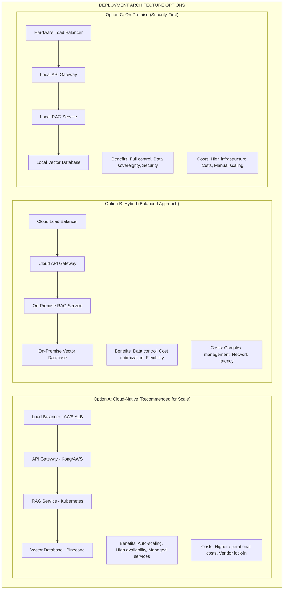

#### **2. Scalability Patterns**
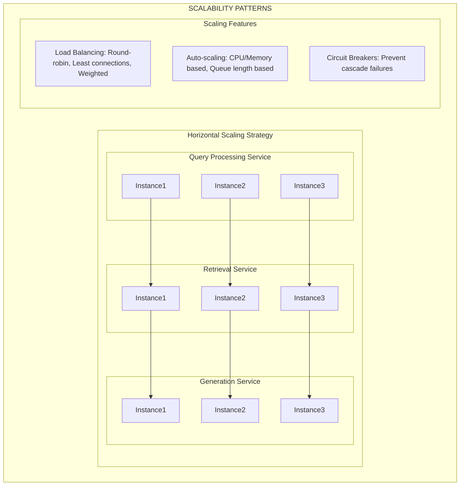

#### **3. Performance Optimization**
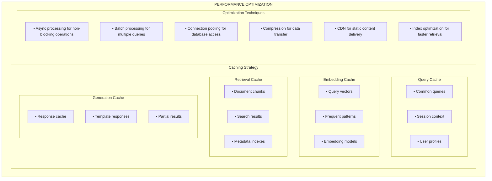

---

## **Security Architecture**

### **Security Framework**
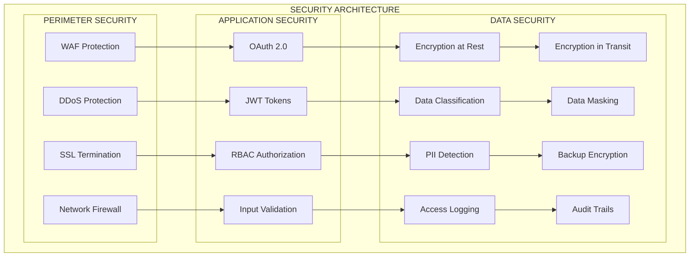

### **Security Controls Matrix**
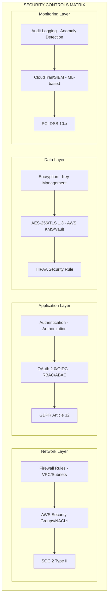

---

## **Scalability & Performance**

### **Performance Metrics & SLAs**
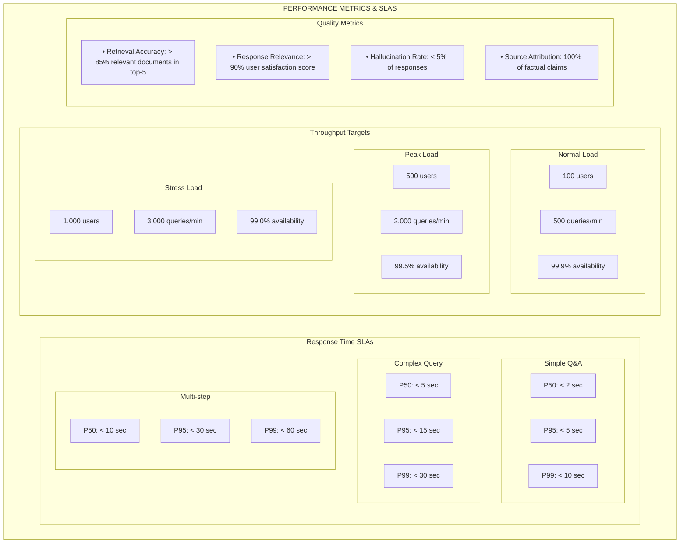

### **Scaling Strategy**
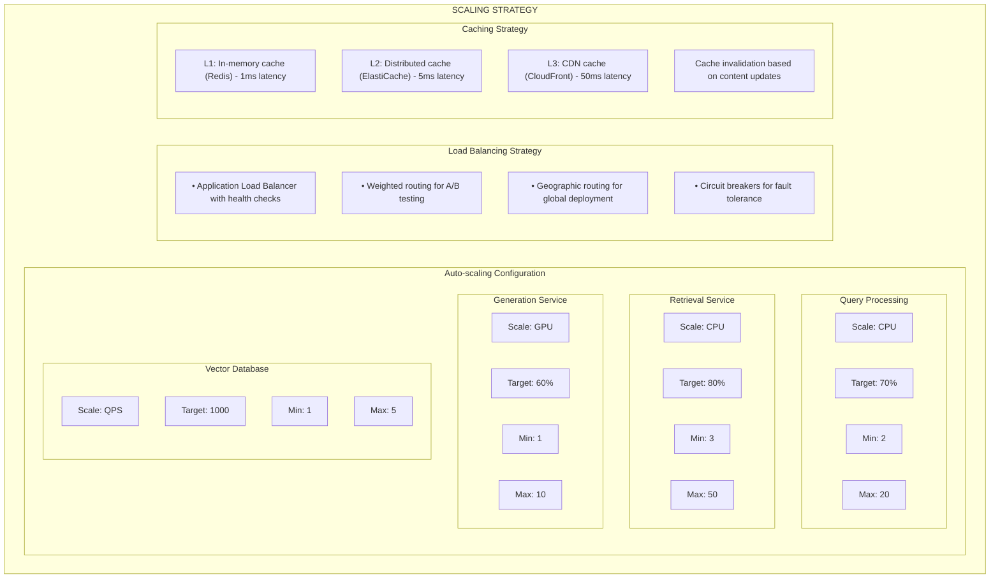

---

## **Deployment Architecture**

### **Multi-Environment Deployment**
```mermaid
graph TB
    subgraph "MULTI-ENVIRONMENT DEPLOYMENT"
        subgraph "Development Environment"
            Dev_IDE[Local IDE]
            Dev_Docker[Docker Containers]
            Dev_VDB[Minimal Vector DB]
            Dev_Data[Sample Data]
            
            Dev_Purpose[Purpose: Feature development, Unit testing, Debugging]
            
            Dev_IDE --- Dev_Docker
            Dev_Docker --- Dev_VDB
            Dev_VDB --- Dev_Data
        end
        
        subgraph "Staging Environment"
            Stg_K8s[Kubernetes Cluster]
            Stg_Services[Scaled Services]
            Stg_VDB[Production Vector DB]
            Stg_Data[Anonymized Data]
            
            Stg_Purpose[Purpose: Integration testing, Performance testing, UAT]
            
            Stg_K8s --- Stg_Services
            Stg_Services --- Stg_VDB
            Stg_VDB --- Stg_Data
        end
        
        subgraph "Production Environment"
            Prod_K8s[Multi-Region Kubernetes]
            Prod_Auto[Auto Scaling]
            Prod_VDB[Enterprise Vector DB]
            Prod_Data[Production Data]
            
            Prod_Purpose[Purpose: Live user traffic, High availability, Full monitoring]
            
            Prod_K8s --- Prod_Auto
            Prod_Auto --- Prod_VDB
            Prod_VDB --- Prod_Data
        end
        
        Dev_Data --> Stg_K8s
        Stg_Data --> Prod_K8s
    end
```

### **CI/CD Pipeline**
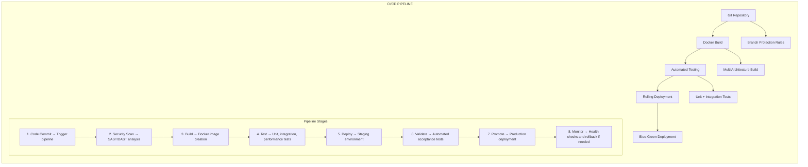

---

## **Monitoring & Observability**

### **Monitoring Architecture**
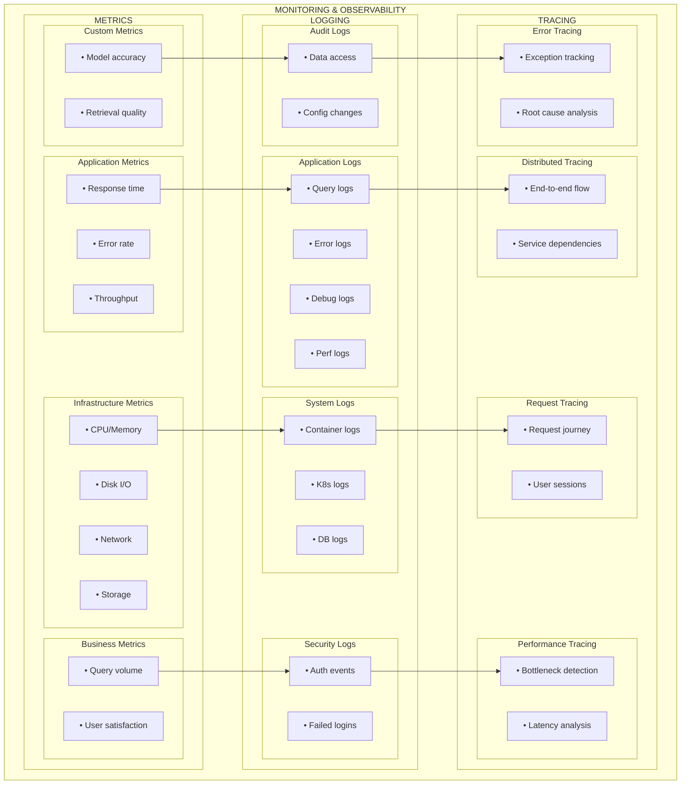

### **Alerting & Incident Response**
```mermaid
graph TB
    subgraph "ALERTING & INCIDENT RESPONSE"
        subgraph "Alert Severity Levels"
            subgraph "CRITICAL"
                C1[• Service down]
                C2[• Data loss]
                C3[• Security breach]
                C_Response[Response: Immediate - PagerDuty]
                
                C1 --> C_Response
                C2 --> C_Response
                C3 --> C_Response
            end
            
            subgraph "WARNING"
                W1[• High latency]
                W2[• Error rate spike]
                W3[• Resource exhaustion]
                W_Response[Response: 30 minutes - Slack/Email]
                
                W1 --> W_Response
                W2 --> W_Response
                W3 --> W_Response
            end
            
            subgraph "INFO"
                I1[• Deployment complete]
                I2[• Scale events]
                I3[• Config changes]
                I_Response[Response: Next day - Email]
                
                I1 --> I_Response
                I2 --> I_Response
                I3 --> I_Response
            end
            
            subgraph "DEBUG"
                D1[• Performance metrics]
                D2[• Debug info]
                D3[• Trace data]
                D_Response[Response: No action - Log only]
                
                D1 --> D_Response
                D2 --> D_Response
                D3 --> D_Response
            end
        end
        
        subgraph "Incident Response Workflow"
            Step1[1. Alert Detection → Automated monitoring triggers]
            Step2[2. Incident Creation → Ticket created in incident management system]
            Step3[3. Team Notification → On-call engineer notified]
            Step4[4. Initial Assessment → Severity and impact evaluation]
            Step5[5. Response Team Assembly → Escalate if needed]
            Step6[6. Investigation → Root cause analysis]
            Step7[7. Resolution → Fix implementation]
            Step8[8. Post-Incident Review → Lessons learned and improvements]
            
            Step1 --> Step2
            Step2 --> Step3
            Step3 --> Step4
            Step4 --> Step5
            Step5 --> Step6
            Step6 --> Step7
            Step7 --> Step8
        end
        
        C_Response --> Step1
        W_Response --> Step1
        I_Response --> Step1
    end
```

---

## **Conclusion**

This RAG Solution Architecture Document provides a comprehensive blueprint for implementing a production-ready Retrieval-Augmented Generation system. The architecture emphasizes:

### **Key Success Factors**
- **Modularity**: Each component can be independently scaled and optimized
- **Reliability**: Built-in redundancy and fault tolerance mechanisms
- **Security**: Comprehensive security controls at every layer
- **Observability**: Full visibility into system performance and behavior
- **Scalability**: Horizontal scaling capabilities for growing demands

### **Implementation Roadmap**
1. **Phase 1**: Core RAG pipeline implementation (Weeks 1-4)
2. **Phase 2**: Security and monitoring integration (Weeks 5-6)
3. **Phase 3**: Performance optimization and scaling (Weeks 7-8)
4. **Phase 4**: Advanced features and enterprise integration (Weeks 9-12)

### **Success Metrics**
- **Technical**: Response time < 5s (P95), Availability > 99.9%
- **Quality**: Relevance score > 90%, Hallucination rate < 5%
- **Business**: User satisfaction > 85%, Cost per query optimization

This architecture serves as a foundation that can be adapted and extended based on specific organizational requirements, compliance needs, and technical constraints.

---

*Document Version: 1.0*  
*Last Updated: August 16, 2025*  
*Next Review: September 16, 2025*
